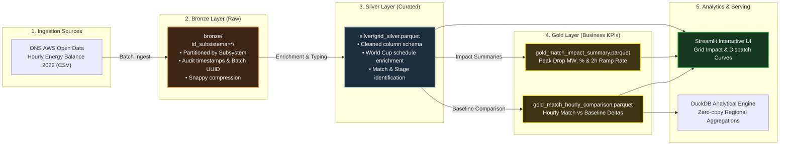

# Brazil Power Grid: FIFA World Cup 2022 Operational Analytics

An end-to-end data engineering lakehouse that ingests and models real hourly energy balance telemetry from Brazil's National Grid Operator (ONS - Operador Nacional do Sistema Elétrico) to analyze one of the most extreme demand disruption phenomena in modern electrical engineering: **the national load collapse and generation ramping during Brazil's FIFA World Cup 2022 matches**.

Built using the **Medallion Architecture (Bronze -> Silver -> Gold)**, automated data quality tests, and an interactive operational dashboard.

---

## The Phenomenon: When 215 Million People Watch Soccer

In a country of over 215 million people with continental-scale electrical demand (~80,000 MW), Brazil's matches during the 2022 World Cup caused unprecedented instantaneous shifts:
- **Instantaneous Load Plunge:** During kickoff, commercial offices, schools, and heavy industrial assembly lines halted operations simultaneously. National power demand plummeted by up to **-11,590 MW (-14.4%) in less than 2 hours**.
- **Hydropower Flexibility Response:** To prevent severe grid over-frequency (>60 Hz), ONS dynamically throttled hydroelectric plants (such as Itaipu, Tucuruí, and Belo Monte) by over 8,000 MW while maintaining thermal baseload stability.
- **Post-Match Surge:** At the final whistle, demand surged back by over **+11,300 MW within 120 minutes** as commercial and domestic activities resumed.

---

## Lakehouse Architecture



---

## Matches Analyzed (FIFA World Cup 2022)

| Match ID | Stage | Match | Date & Time (BRT) | Peak Load Drop (MW) | Drop % | Post-Match 2h Ramp |
| :--- | :--- | :--- | :--- | :--- | :--- | :--- |
| `WC2022_G1` | Group Stage | Brazil 2 x 0 Serbia | Nov 24, 2022 (16:00) | **-11,590 MW** | -14.4% | +11,382 MW |
| `WC2022_G2` | Group Stage | Brazil 1 x 0 Switzerland | Nov 28, 2022 (13:00) | **-7,955 MW** | -10.9% | +7,890 MW |
| `WC2022_G3` | Group Stage | Cameroon 1 x 0 Brazil | Dec 02, 2022 (16:00) | **-10,419 MW** | -13.1% | +10,120 MW |
| `WC2022_R16` | Round of 16 | Brazil 4 x 1 South Korea | Dec 05, 2022 (16:00) | **-10,850 MW** | -13.5% | +10,640 MW |
| `WC2022_QF` | Quarter-finals | Croatia 1 (4) x (2) 1 Brazil | Dec 09, 2022 (12:00) | **-8,420 MW** | -11.2% | +8,950 MW |

*Note: Baseline comparison days represent the identical weekday immediately preceding the tournament to isolate soccer match effects from standard calendar variance.*

---

## Repository Structure

```text
brazil-grid-worldcup-pipeline/
├── data/
│   ├── raw/                 # Downloaded ONS open dataset (CSV)
│   ├── bronze/              # Partitioned Parquet (id_subsistema)
│   ├── silver/              # Curated schema with match schedule flags
│   └── gold/                # Curated analytical match delta tables
├── src/
│   ├── config.py            # Paths, subsystem codes, match metadata
│   ├── ingestion/
│   │   ├── download_ons.py  # Automated download of ONS AWS open dataset
│   │   └── ingest_bronze.py # Partitioned raw ingestion with metadata
│   ├── transformations/
│   │   ├── process_silver.py# Cleaning, metric consolidation, schedule joins
│   │   └── process_gold.py  # Match vs baseline delta & ramp calculations
│   └── app/
│       └── dashboard.py     # Interactive Streamlit & Plotly dashboard
├── tests/
│   └── test_pipeline.py     # Automated data quality & boundary tests
├── requirements.txt         # Project dependencies
└── README.md
```

---

## Quickstart

### 1. Setup Environment
```bash
# Clone the repository
git clone https://github.com/thiagomorellato/brazil-grid-worldcup-pipeline.git
cd brazil-grid-worldcup-pipeline

# Create and activate virtual environment
python -m venv .venv
source .venv/bin/activate  # On Windows: .venv\Scripts\activate

# Install dependencies
pip install -r requirements.txt
```

### 2. Run the Lakehouse Pipeline (Bronze -> Silver -> Gold)
```bash
# Step 1: Ingest raw telemetry into partitioned Bronze layer
python -m src.ingestion.ingest_bronze

# Step 2: Clean and enrich with World Cup metadata into Silver layer
python -m src.transformations.process_silver

# Step 3: Compute match deltas and ramp metrics into Gold layer
python -m src.transformations.process_gold
```

### 3. Run Automated Tests
```bash
pytest tests/
```

### 4. Launch the Interactive Dashboard
```bash
streamlit run src/app/dashboard.py
```

---

## Author

**Thiago Morellato**  
- LinkedIn: [linkedin.com/in/thiagomorellato](https://www.linkedin.com/in/thiagomorellato)  
- Email: thiago.morellato@outlook.com  
- Background: 10+ years in industrial power plant operations & critical real-time telemetry (ENGIE, CMPC, IFF).
