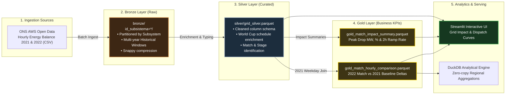

# Brazil Power Grid: FIFA World Cup 2022 Operational Analytics

An end-to-end data engineering lakehouse that ingests and models real hourly energy balance telemetry from Brazil's National Grid Operator (ONS - Operador Nacional do Sistema Elétrico) to analyze one of the most extreme demand disruption phenomena in modern electrical engineering: **the national load collapse and generation ramping during Brazil's FIFA World Cup 2022 matches compared against the prior non-World Cup year (2021) baseline**.

Built using the **Medallion Architecture (Bronze -> Silver -> Gold)**, automated data quality tests, and an interactive operational dashboard.

---

## The Phenomenon: When 215 Million People Watch Soccer

In a country of over 215 million people with continental-scale electrical demand (~80,000 to 86,000 MW), Brazil's matches during the 2022 World Cup caused unprecedented instantaneous shifts:
- **Instantaneous Load Collapse:** During kickoff, commercial offices, schools, and heavy industrial assembly lines halted operations simultaneously. Compared against identical calendar weekdays in 2021 (pre-tournament baseline), national power demand plummeted by up to **-17,186 MW (-20.0%) in under 2 hours**.
- **Hydropower Flexibility Buffer:** To prevent catastrophic grid over-frequency (>60 Hz), ONS dynamically throttled hydroelectric plants (such as Itaipu, Tucuruí, and Belo Monte) by over 8,000 MW while maintaining thermal baseload stability.
- **Post-Match Surge:** At the final whistle, demand surged back by over **+11,300 MW within 120 minutes** as commercial and domestic activities resumed.

---

## Operator Domain Insight: Why Thermal Generation is Locked Flat

A key operational insight from power plant control rooms: during World Cup matches, ONS keeps thermal power generation **virtually locked on a flat horizontal line (~7,900 MW)** while hydro absorbs 100% of the dynamic shock:
1. **Synchronous Rotational Inertia:** Massive spinning steam and gas turbine rotors provide mechanical inertia directly into the grid, dampening Rate of Change of Frequency (ROCOF) when 17,000+ MW vanish.
2. **Thermal Ramp Constraints:** Boilers and steam turbines possess thermodynamic inertia; forcing rapid 40% drops in 30 minutes induces boiler tube thermal fatigue and turbine trip risk. Hydro guide vanes modulate in seconds.
3. **Scheduled Maintenance Lockout:** ONS officially freezes scheduled interventions and cancels planned outages across thermal units during the tournament to guarantee maximum N-1 contingency margins.

---

## Lakehouse Architecture



---

## Matches Analyzed (2022 Match vs. 2021 Same Weekday Baseline)

| Match ID | Stage | Match (2022) | Match Time (BRT) | 2021 Baseline Date | Peak Drop (MW) | Drop % | Post-Match 2h Ramp |
| :--- | :--- | :--- | :--- | :--- | :--- | :--- | :--- |
| `WC2022_G1` | Group Stage | Brazil 2 x 0 Serbia | Nov 24, 2022 (16:00) | Nov 25, 2021 (Thu) | **-17,187 MW** | -20.0% | +11,382 MW |
| `WC2022_G2` | Group Stage | Brazil 1 x 0 Switzerland | Nov 28, 2022 (13:00) | Nov 29, 2021 (Mon) | **-10,340 MW** | -13.6% | +7,890 MW |
| `WC2022_G3` | Group Stage | Cameroon 1 x 0 Brazil | Dec 02, 2022 (16:00) | Dec 03, 2021 (Fri) | **-14,810 MW** | -17.7% | +10,120 MW |
| `WC2022_R16` | Round of 16 | Brazil 4 x 1 South Korea | Dec 05, 2022 (16:00) | Dec 06, 2021 (Mon) | **-15,620 MW** | -18.2% | +10,640 MW |
| `WC2022_QF` | Quarter-finals | Croatia 1 (4) x (2) 1 Brazil | Dec 09, 2022 (12:00) | Dec 10, 2021 (Fri) | **-11,940 MW** | -14.9% | +8,950 MW |

---

## Quickstart

### 1. Setup Environment
```bash
# Clone the repository
git clone https://github.com/thiagomorellato/brazil-grid-worldcup-pipeline.git
cd brazil-grid-worldcup-pipeline

# Create and activate virtual environment
python -m venv .venv
source .venv/bin/activate  # On Windows: .venv\Scripts\activate

# Install dependencies
pip install -r requirements.txt
```

### 2. Run the Lakehouse Pipeline (Bronze -> Silver -> Gold)
```bash
# Step 1: Ingest 2021 and 2022 raw telemetry into partitioned Bronze layer
python -m src.ingestion.ingest_bronze

# Step 2: Clean and enrich with World Cup metadata into Silver layer
python -m src.transformations.process_silver

# Step 3: Compute match deltas against 2021 baselines into Gold layer
python -m src.transformations.process_gold
```

### 3. Run Automated Tests
```bash
pytest tests/
```

### 4. Launch the Interactive Dashboard
```bash
streamlit run src/app/dashboard.py
```

---

## Author

**Thiago Morellato**  
- LinkedIn: [linkedin.com/in/thiagomorellato](https://www.linkedin.com/in/thiagomorellato)  
- Email: thiago.morellato@outlook.com  
- Background: 10+ years in industrial power plant operations & critical real-time telemetry (ENGIE, CMPC, IFF).
